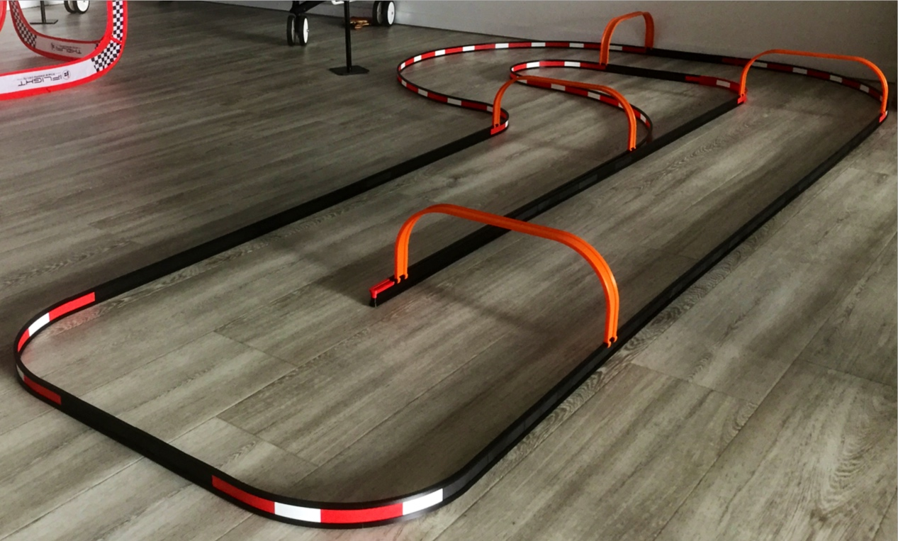

# 1/24 to 1/32 scale RC-track system

A printable race track systems for remote controlled cars from scale 1/24 to 1/32.

<!-- vscode-markdown-toc -->

-   [At a glance](#Ataglance)
-   [Configuration](#Configuration)
-   [Render the parts](#Rendertheparts)
-   [Post-scripts](#Post-scripts)

<!-- vscode-markdown-toc-config
	numbering=false
	autoSave=true
	/vscode-markdown-toc-config -->
<!-- /vscode-markdown-toc -->

## <a name='Ataglance'></a>At a glance

The project contains designs for a modular race track system aimed at remote controlled cars. The parts are designed using a scripting language, processed by [OpenSCAD](https://openscad.org/about.html). There is no ready to use 3D model files in the source code. If you are interested in such files, please look at the [released versions](https://github.com/jsconan/rc-tracks/releases) which contains 3D model files built with default parameters. However, if you want to customize these parts, tailoring them with your measures, you should rather download the source code and then tweak the configuration files before generating your own 3D model files.

> **Note:** the scales are given as an estimate, not all scales have been tested. The `1/24 to 1/32` variant has been tested with `1/28` scale models.

This variant contains a set of track barriers that can be used to delimit a race track. To keep a regular track width and to prevent the barriers to be pushed out, a set of arches is proposed to link together the two sides of the track lane. As the barriers, as well as the arches, are modular, you can design tracks of various sizes. The only limit is the size of your printer.

Two versions of the barriers exist:

-   A composite version made from 3 parts: a bottom and a top beam clipping a blade. This variant is faster to print, but requires more work to build the barriers.
-   A unibody version made from a single piece. This variant is slower to print, but it makes it easier to build the race track.

A particular set of parts is also proposed to allow joining barriers from both versions.



## <a name='Configuration'></a>Configuration

The configuration may be changed locally. To not collide with changes in the main implementation, the configuration files are not versioned. Instead, you will find `-dist` files that contain a copy of the typical configuration.

From a fresh copy of the project, you will need first to create these configuration files. The easiest way is to call the `init.sh` script, that will take care of this for you. The configuration files will also be checked and created if needed each time the `render.sh` script is called.

This initial creation of the configuration files could also be done manually. Here is how:

1. Go to the `config` folder
2. Copy any of the files having a `-dist` suffix in their name to a file without this suffix.

    _Example:_ copy `config-dist.scad` to `config.scad`

## <a name='Rendertheparts'></a>Render the parts

The parts are all located into the `parts` folder. They can all be opened separately in [OpenSCAD](https://openscad.org/) and rendered.

However, it is possible to render all parts in batch. The script `render.sh` takes care of this.

This is a command-line tool, which accept several parameters. By default, it will render the preset selected in the config.

It is possible to select another preset, as well as set a different number of cells for the containers.

The parameter `-h` make it show the help.

Running the command `render.sh -h` will show this message:

```
Renders OpenSCAD files
  Usage:
	./render.sh [command] [-h|--help] [-o|--option value] files

  a,  accessories     Render the accessories
  e,  elements        Render the track separated elements
  u,  unibody         Render the track unibody elements
  s,  samples         Render the samples
  p,  plates          Render the plates
  c,  config          Show the config values
  -h,  --help         Show this help
  -l,  --length       Set the length of a track section
  -w,  --width        Set the virtual width of a track lane (used to compute the radius)
  -t   --track        Set the actual width of a track lane (physical width, used for the arches)
  -b   --height       Set the height of the track barrier
  -r   --radius       Set the radius of the track inner curve
  -m   --sample       Set the size of sample element
  -f   --format       Set the output format
  -p   --parallel     Set the number of parallel processes
  -s   --slice        Slice the rendered files using the default configuration
  -c   --clean        Clean up the output folder before rendering
```

The STL files are rendered to the `dist/stl` folder.

If the slicer [PrusaSlicer](https://github.com/prusa3d/PrusaSlicer) is installed, running the command `render.sh -s` will produce the [G-code](https://en.wikipedia.org/wiki/G-code) from the rendered STL files and using the setting from the file `config/config.ini`. Out of the box, it is produce instruction for PETG and a 0.2mm layer height.

## <a name='Post-scripts'></a>Post-scripts

When using the built-in script to render/slice the models in batch, you can also add custom post-processing scripts. There is one for `render.sh` and one for `slice.sh`. They are respectively named `post-render.sh` and `post-slice.sh`.

As these script can be defined locally, they are not part of the versioned content. Instead, you can find sample files at `post-render-dist.sh` and `post-slice-dist.sh`. To use them, you need to:

-   copy the dist file to a local file, for example: `cp post-render-dist.sh post-render.sh`.
-   you need to make sure the file is executable: `chmod +x post-render.sh`.
-   finally, add you own commands to the copy.

As an example:

-   The script used to zip the rendered files:

```sh
# Bootstrap the script
scriptpath=$(dirname $0)
source "${scriptpath}/../lib/camelSCAD/scripts/utils.sh"

# Script config
project=$(pwd)
stlpath="${project}/dist/stl/"
zippath="stl-scale-24.zip"
logpath="${project}/dist/zip.log"

# Post process the rendered files
printmessage "${C_MSG}==========================================="
printmessage "${C_MSG}Post-render script: zip files"
dummy=$(
    cd "${stlpath}"
    rm *.zip > /dev/null
    zip -r "${zippath}" *
)
printmessage "${C_MSG}==========================================="
```

-   The script used to copy the sliced files to a SD-card:

```sh
# Bootstrap the script
scriptpath=$(dirname $0)
source "${scriptpath}/../lib/camelSCAD/scripts/utils.sh"

# Script config
project=$(pwd)
gcodepath="${project}/dist/gcode/"
sdcardpath="/PATH/TO/SD/CARD"   # <-- CHANGE THIS!
logpath="${project}/dist/gcode-sync.log"

# Post process the sliced files
printmessage "${C_MSG}==========================================="
printmessage "${C_MSG}Post-slice script: copy Gcode to the SDcard"
date > ${logpath}
createpath "${sdcardpath}"
rsync -ahvt --no-links --delete --partial --force --modify-window=1 --exclude=.DS_Store --log-file=${logpath} "${gcodepath}" "${sdcardpath}"
printmessage "${C_MSG}==========================================="
```
