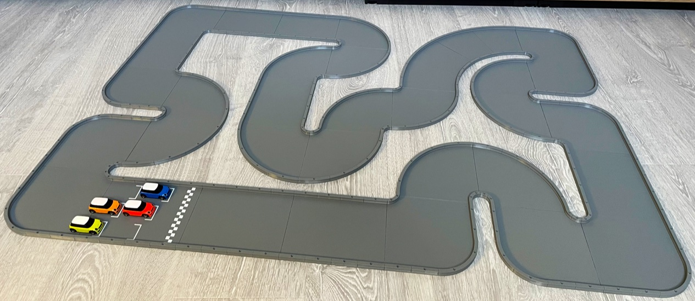
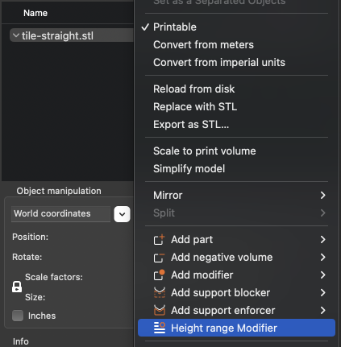
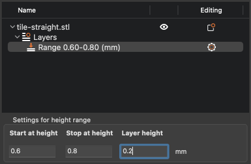
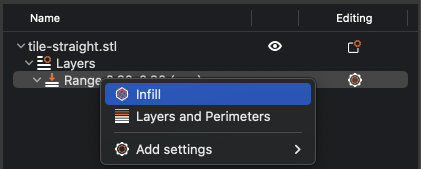
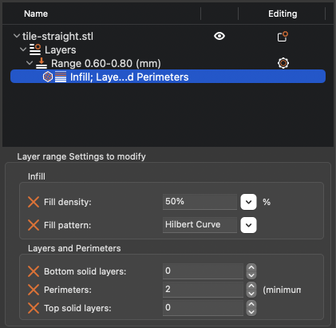

# 1/64 to 1/76 scale RC-track system

A printable race track systems for remote controlled cars from scale 1/64 to 1/76.

<!-- vscode-markdown-toc -->

-   [At a glance](#Ataglance)
    -   [Split tiles](#Splittiles)
    -   [Full tiles](#Fulltiles)
-   [Configuration](#Configuration)
-   [Render the parts](#Rendertheparts)
-   [Post-scripts](#Post-scripts)

<!-- vscode-markdown-toc-config
	numbering=false
	autoSave=true
	/vscode-markdown-toc-config -->
<!-- /vscode-markdown-toc -->

## <a name='Ataglance'></a>At a glance

The project contains designs for a modular race track system aimed at remote controlled cars. The parts are designed using a scripting language, processed by [OpenSCAD](https://openscad.org/about.html). There is no ready to use 3D model files in the source code. If you are interested in such files, please look at the [released versions](https://github.com/jsconan/rc-tracks/releases) which contains 3D model files built with default parameters. However, if you want to customize these parts, tailoring them with your measures, you should rather download the source code and then tweak the configuration files before generating your own 3D model files.

> **Note:** the scales are given as an estimate, not all scales have been tested. The `1/64 to 1/76` variant has been tested with `1/76` scale models.

This variant contains a set of track barriers and ground tiles that can be assembled together in order to design a race track. To keep the track in place, each barrier comes with a fastener hole allowing to screw or nail it to a board. As the barriers, as well as the tiles, are modular, you can design tracks of various sizes. The only limit is the size of your printer.

There are multiple ways of using this modular system:

-   barriers only
-   ground tiles only with another set of barriers
-   both barriers and ground tiles
-   full tiles printed with ground and barriers together



### <a name='Splittiles'></a>Split tiles

The base variant relies on split parts, barriers and ground, to be assembled together. This allows to print each part in a different color. However, this variant may take longer to be printed, and this makes the build less easier as each single part must be added and fastened separately. This is a good choice when the race track is intended to be fixed on a board, the barriers have holes for screwing or nailing the track to a support.


### <a name='Fulltiles'></a>Full tiles

An additional variant is proposed, with full tiles printed in place, containing both the ground and the barrier. This variant is a bit faster to be printed, and it makes it easier to build the race track. However, each tile will come in a single color. but it could still be painted if needed. This variant also have holes for screwing or nailing the track to a support.


### Printing tweaks

Depending on the printed material, the surface may not be rough enough for the car wheels to grip. This can be fixed by sanding the printed tiles. This can also be fixed by tweaking the print in order to give the tiles ground a bit more grip.

Using [PrusaSlicer](https://github.com/prusa3d/PrusaSlicer), the print model can be adjusted so that a part of it has a different setting. For example, we can change how the last layer of the tile ground is printed. A good choice is to turn off the top layer infill, then change the infill pattern for this layer only.

From the PrusaSlicer GUI, do a right-click on the model, then add a **Height range modifier**.



Select the newly added layer range, then set the right position. With respect to the default config, the ground is 0.8mm thick, and each layer is 0.2mm, so we need to position the modifier on the layer 0.6 to 0.8.



As wee want to tweak the infill, right-click on the range, and add an infill from the menu.



Finally, we need to switch off the top layer infill and set a different infill for this particular layer. Make sure to set `0` to the **Top solid layers** entry. Then select a fill pattern for the regular infill. As a suggestion, the **Hilbert curve** with a 50% density gives a decent grip and a pretty nice finish.



Note: this tweak applies from the version 2.3 of the software.

This tweak could also apply to the original software, say [Slic3r](https://slic3r.org/). But the settings may differ slightly.

## <a name='Configuration'></a>Configuration

The configuration may be changed locally. To not collide with changes in the main implementation, the configuration files are not versioned. Instead, you will find `-dist` files that contain a copy of the typical configuration.

From a fresh copy of the project, you will need first to create these configuration files. The easiest way is to call the `init.sh` script, that will take care of this for you. The configuration files will also be checked and created if needed each time the `render.sh` script is called.

This initial creation of the configuration files could also be done manually. Here is how:

1. Go to the `config` folder
2. Copy any of the files having a `-dist` suffix in their name to a file without this suffix.

    _Example:_ copy `config-dist.scad` to `config.scad`

## <a name='Rendertheparts'></a>Render the parts

The parts are all located into the `parts` folder. They can all be opened separately in [OpenSCAD](https://openscad.org/) and rendered.

However, it is possible to render all parts in batch. The script `render.sh` takes care of this.

This is a command-line tool, which accept several parameters. By default, it will render the preset selected in the config.

It is possible to select another preset, as well as set a different number of cells for the containers.

The parameter `-h` make it show the help.

Running the command `render.sh -h` will show this message:

```
Renders OpenSCAD files
  Usage:
	./render.sh [command] [-h|--help] [-o|--option value] files

  a,   all            Render all elements (default)
  b,   barriers       Render the sets of barriers
  e,   elements       Render the elements
  g,   ground         Render the ground tiles
  f,   tiles          Render the full tiles
  t,   tools          Render the tools
  c,   config         Show the config values
  -h,  --help         Show this help
  -t   --track        Set the width of the track lane
  -w,  --width        Set the width of the track barriers
  -b   --height       Set the height of the track barriers
  -k   --chunks       Set the number of barrier chunks per track section
  -g   --ground       Set the thickness of the ground tiles
  -d   --diameter     Set the diameter of the barrier fasteners
  -hd  --headDiameter Set the diameter of the barrier fasteners head
  -hh  --headHeight   Set the height of the barrier fasteners head
  -u   --upsideDown   Flip the ground tiles to print them upside down
  -q   --quantity     Set the quantity of elements to print per set
  -f   --format       Set the output format
  -p   --parallel     Set the number of parallel processes
  -s   --slice        Slice the rendered files using the default configuration
  -c   --clean        Clean up the output folder before rendering
```

The STL files are rendered to the `dist/stl` folder.

If the slicer [PrusaSlicer](https://github.com/prusa3d/PrusaSlicer) is installed, running the command `render.sh -s` will produce the [G-code](https://en.wikipedia.org/wiki/G-code) from the rendered STL files and using the setting from the file `config/config.ini`. Out of the box, it is produce instruction for PETG and a 0.2mm layer height.

## <a name='Post-scripts'></a>Post-scripts

When using the built-in script to render/slice the models in batch, you can also add custom post-processing scripts. There is one for `render.sh` and one for `slice.sh`. They are respectively named `post-render.sh` and `post-slice.sh`.

As these script can be defined locally, they are not part of the versioned content. Instead, you can find sample files at `post-render-dist.sh` and `post-slice-dist.sh`. To use them, you need to:

-   copy the dist file to a local file, for example: `cp post-render-dist.sh post-render.sh`.
-   you need to make sure the file is executable: `chmod +x post-render.sh`.
-   finally, add you own commands to the copy.

As an example:

-   The script used to zip the rendered files:

```sh
# Bootstrap the script
scriptpath=$(dirname $0)
source "${scriptpath}/../lib/camelSCAD/scripts/utils.sh"

# Script config
project=$(pwd)
stlpath="${project}/dist/stl/"
zippath="stl-scale-64.zip"
logpath="${project}/dist/zip.log"

# Post process the rendered files
printmessage "${C_MSG}==========================================="
printmessage "${C_MSG}Post-render script: zip files"
dummy=$(
    cd "${stlpath}"
    rm *.zip > /dev/null
    zip -r "${zippath}" *
)
printmessage "${C_MSG}==========================================="
```

-   The script used to copy the sliced files to a SD-card:

```sh
# Bootstrap the script
scriptpath=$(dirname $0)
source "${scriptpath}/../lib/camelSCAD/scripts/utils.sh"

# Script config
project=$(pwd)
gcodepath="${project}/dist/gcode/"
sdcardpath="/PATH/TO/SD/CARD"   # <-- CHANGE THIS!
logpath="${project}/dist/gcode-sync.log"

# Post process the sliced files
printmessage "${C_MSG}==========================================="
printmessage "${C_MSG}Post-slice script: copy Gcode to the SDcard"
date > ${logpath}
createpath "${sdcardpath}"
rsync -ahvt --no-links --delete --partial --force --modify-window=1 --exclude=.DS_Store --log-file=${logpath} "${gcodepath}" "${sdcardpath}"
printmessage "${C_MSG}==========================================="
```
